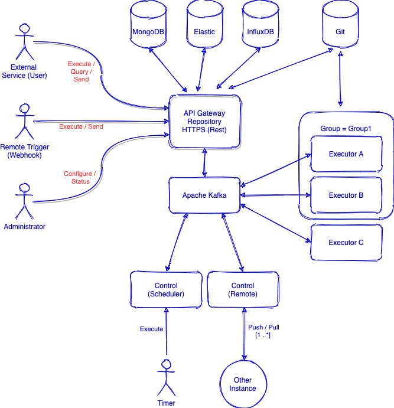

# Welcome to Infolayer.io Project

Infolayer project is an abstraction layer for tools and frameworks responsible for IT services provisioning, monitoring and orchestration. Our goal is to provide a gateway interface for frameworks and repeatable activities and response to events.

**Motivation**

| Use case | Solutions | Our goal |
|-|-|-|
|Service provisioning and configuration|Ansible, Terraform, ...|Abstracts and reuse well formated templates on each known framework|
|Server monitoring|Zabbix, Site24x7, NewRelic, ...|Complements and easly maintaing such monitoring tools|
|Daily administration|A plenty of tools|Helps author, schedule and scale|

**Current supported frameworks and resources**

- Generic Shell (Bash/Perl/Python) Linux Script. The script can output data or just an exit code.
- Generic PowerShell Script. The script can output data or just an exit code.
- Ansible Playbook. The ansible playbook will be called passing Inventory and variables.
- Monitoring queries (SNMP 1/2/3) customized and using the provided Java's SNMP plugin. SNMP Trapps is not yet supported.
- SQL queries (JDBC driver) customized and using the provided Java's JDBC plugin.
- Custom Java code.

**Future plans**

- Support for events!
- Support for events in SNMP Traps format.
- Support for events in E-mail reading.
- Support for events in GELF (Graylog Extend Log format).

## Setup and quick start

To setup a new environment, visit [Setup](docs/Setup.md).

To quick start on a new environment, visit [Quick start](setup/QuickStart.md).

## Concept

### Architecture



### Infolayer Instance

An instance is a group of resources: Service BUS, API Gateway, Repositories, Scheduler, Remote and Executor Services.

## Components

### Service BUS

It is Apache Kafka.

### API Gateway Service

Responsible for Input/Output. Users reach frameworks and repositories thrugh this component. The protocol is HTTPS and the API is Rest format. Check documentation for examples.

### Repositories

|Use case|Technology|Role|
|-|-|-|
|System configuration|MongoDB 4.2+|Stores system configuration and entities|
|Inventory|MongoDB 4.2+|Inventory services|
|Events|Elasticserach 6.8+|Events and messages|
|Statistics|InfluxDB|Metrics and timeseries tables|
|Code|Git|Execution code responsible for actions, data ingest and response to events|

### Scheduler

Reads from the service bus scheduled tasks, holds the scheduler trigger and fire. Scheduler has no user interaction and all the configuration is done by the API Gateway Services. You may or may not have an Scheduler in our setup. Stopping the scheduler services simple stop triggering scheduled tasks.

### Remote

Responsible for dealing with distributed configuration and data exchange. Each instance can be connected to a upper instance creating an hierachical management structure. Remote operations are always assincronous.

### Executor Service

Executor Services are responsible for running code (talk to the supported framework). Code is ```code``` found under a repository (Git for exeample). Each Executor Service is connected to the service bus (Apache Kafka dependant) building executors instances or executors instance groups.

You can have as many as necessary Executors Services and some can be specialized for different tasks. You might need just for Linux/Unix and another for Windows specific tasks. Also, in case your need relies on massive SQL queries (maybe you are monitoring a huge RDBMS site) you should consider deploying a group of Executors for JDBC queries in a load balancing strategy.

## Creating a Runbook

A Runbook is a pre-defined and templated code sequence done by plugins.

```yaml
name: Name of your Runbook          #<- Required
enabled: false                      #<- Default is true. Can be ommited
schedule: 0 */3 * ? * *             #<- Example, defines a recurrent trigger. Can be ommited
repository: name                    #<- Name of repository to lookup code. If ommited default is used
tags: tag1, tag2, tag3              #<- List of tags

do:                                 #<- Required (at least one)
    - plugin-name:                  #<- Name of the plugin (executor)
        param1: foo                 #<- Parameters are easly declared
        param2: bar
        param3: true

    - another-plugin-name:          #<- Sequencial execution
        param1: foo
        do:                         #<- Required (nested calls)
            plugin-name:
            target: ${env:variable} #<- Templating. Check documentation for known options
            topPorts: 50
            timeout: 4320000
```

## Creating a Plugin

You can create a **new plugin** (annotated java class) or **decorating** (yaml or xml file) for an already existent plugin.

### Annotated java class

```java
import io.infolayer.siteview.annotation.Plugin;
import io.infolayer.siteview.annotation.PluginParameter;
import io.infolayer.siteview.plugins.runnable.AbstractRunnablePlugin;

@Plugin(
        name = "my-first-plugin", 
        description = "MyFirstPlugin named as my-first-plugin (but can be anything)",
        platform = "windows/x86,linux/arm",
        timeout = 60)
public class MyFirstPlugin extends AbstractRunnablePlugin {

    @PluginParameter(required = true)
    private String foo;

    @PluginParameter(defaultValue = "bar")
    private String bar;

    @PluginParameter
    private boolean another;
    
    /** parameters... **/

    @Override
    public void run() {
        /** running code **/
    }
}
```

### Decorating an existant plugin (hiding complexity and making a frendly interface)

```xml
<?xml version="1.0"?>
<plugin platform="*" description="IBM HMC Scanner discovery" name="hmc-scan">
    <environment>
        <!-- Hidden feature to export plugin resource path when loaded -->
        <env name="plugin_resource_path" value="true"/>
    </environment>

    <parameters>
        <parameter name="hostname" required="true" defaultValue="hmchost.fqdn"/>
        <parameter name="credentials" required="true" defaultValue="hmc" credentials="true"/>
    </parameters>

    <run timeout="360" 
    class="io.infolayer.siteview.plugins.runnable.UnixProcessRunnablePlugin" 
    configurationParser="io.infolayer.siteview.plugins.parser.CommandRunParser">
        <command>java -Duser.language=en -cp "${env:plugin_resource_path}/0.11.42/jsch-0.1.55.jar:${env:plugin_resource_path}/0.11.42/hmcScanner.jar:${env:plugin_resource_path}/0.11.42/jxl.jar" hmcScanner.Loader ${param:hostname} ${param:credentials_key} -p ${param:credentials_secret} -dir ${env:flowdir} -csv -log ${env:flowdir}/hmcscanner.log
        </command>
        <handler class="plugin.ibm.hmcscanner.HMCScannerParser"/>
    </run>
</plugin>
```

Then, plugins can be used on your Runbook.

```yaml
name: Calling MyFirstPlugin and a decorated UnixProcessRunnablePlugin 
do:                                 
    - my-first-plugin:                    
        foo: foo-value
    - hmc-scan:
        hostname: hmcprd.myfqdn.local
```

## Code

- Components are pure Java code. Executor Services relies on OSGi (Apache Felix) for class loading isolation and mudularity.

## Build

- Build is done by maven build. You can simple execute: ```cd io.infolayer && ./mvnw install```
- A fresh distribuition of executor service: ```cd io.infolayer.executor/distribution && ./mvnw install```

## Deploy

To setup a new environment, visit [Setup](docs/Setup.md).

